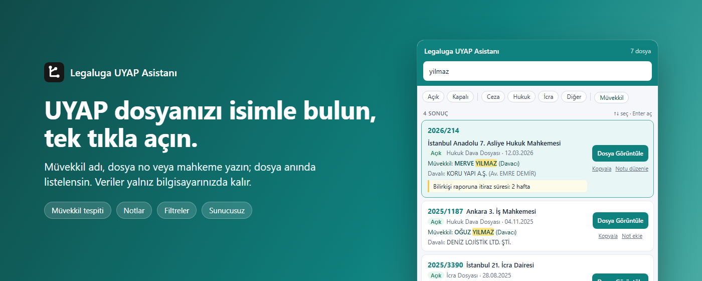
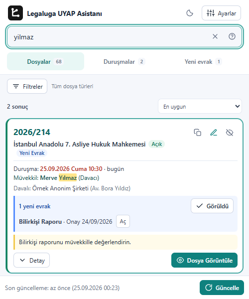
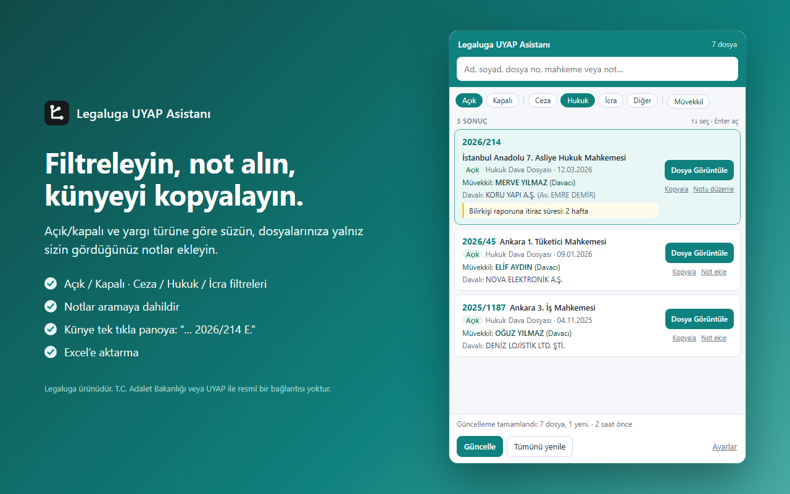
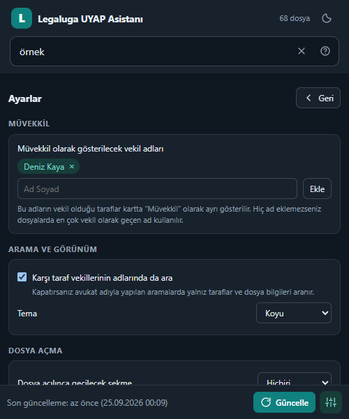

  

<h1 align="center">Legaluga UYAP Asistanı</h1>

  <strong>Dosyanızı isimle bulun. UYAP'ta tek tıkla açın.</strong> 
  UYAP Avukat Portalı için ücretsiz, kaynak kodu herkese açık Chrome eklentisi.

  <a href="https://chromewebstore.google.com/detail/legaluga-uyap-asistan%C4%B1/aicknihmpdcbfgidifffinnbgbghkmcn?hl=tr"><strong>⬇️ Chrome'a ekle</strong></a>
  &nbsp;·&nbsp; <a href="#nasıl-çalışır">Nasıl çalışır?</a>
  &nbsp;·&nbsp; <a href="#gizlilik">Gizlilik</a>
  &nbsp;·&nbsp; <a href="#güvenlik-mimarisi">Güvenlik</a>

---

| 🔎 **İsimle ara** | 🗂️ **Tek tıkla aç** | 🔔 **Takip et** |
| :--- | :--- | :--- |
| Kişi adı, dosya no, mahkeme veya not yazın. Türkçe karakter şart değil. | Sonuçtaki dosyayı UYAP'ta doğrudan açın. | Duruşmaları ve isteğe bağlı yeni evrakları görün. |

## Nasıl çalışır?

1. **Güncelle:** UYAP oturumunuzdaki dosyalar yerel indekse alınır.
2. **Ara:** İsmi, dosya numarasını veya mahkemeyi yazın.
3. **Aç:** **Dosya Görüntüle**'ye basın.

## Eklentiden bir bakış

| Açık tema | Koyu tema |
| :---: | :---: |
|  |  |

*1.14.2 arayüzü; görüntülerde örnek veriler kullanılmıştır. Mağaza sürümü inceleme durumuna göre farklı olabilir.*

Ayarları görüntüle

| İhtiyacınız | Kısayolunuz |
| :--- | :--- |
| Günlük işlere odaklanın | **Dosyalar · Duruşmalar · Yeni evrak** görünümleri arasında geçin. Duruşmalarda **Bugün / Önümüzdeki 7 gün / Tümü** aralığını seçin. Yeni evrak kartında **Tümünü göster** ile kalan evrakları açın. |
| Aradığınızı daraltın | **Filtreler**'i açın; durum, yargı türü ve taraf seçin. **Temizle** ile filtreleri kaldırın. Sonuçları uygunluğa, açılış tarihine veya dosya numarasına göre sıralayın. |
| Kendinize göre kullanın | Üstteki tema düğmesiyle açık/koyu görünümü değiştirin. UYAP'ın sağ kenarındaki **Legaluga Asistan** panelini **sabitleyin**, sayfaya tıklarken açık kalsın. İlk kurulumda şeridin yerini gösteren kısa bir ipucu görünür. |
| UYAP ekranını görün | Sayfa içi panel açılınca UYAP kalan alana sığar; saat ve profil bilgileri görünür kalır. UYAP'ın erişilebilirlik menüsü açıkken Legaluga sekmesi gizlenir ve sonra geri gelir. |
| Duyuruları kaçırmayın | Kesinti ve bakım duyuruları UYAP Ana Sayfa'da belirgin bir uyarı olarak görünür; diğer duyurular sağ altta kalır. Tam metni doğrudan okuyun, boş alana tıklayarak kapatın. |

Arama kutusundayken **↑ ↓** ile sonuç seçin, **Enter** ile açın, **Esc** ile geri dönün; **Tab** ile düğmelere geçin. Aynı kişinin dosyalarını adına tıklayarak görün, dosya kartına not ekleyin. Duruşma uyarılarını **Ayarlar → UYAP → Yaklaşan duruşmaları hatırlat** seçeneğinden yönetin.

## Kurulum

1. **[Chrome Web Mağazası'nda aç →](https://chromewebstore.google.com/detail/legaluga-uyap-asistan%C4%B1/aicknihmpdcbfgidifffinnbgbghkmcn?hl=tr)** bağlantısına gidip **Chrome'a ekle**'ye basın.
2. Eklentiyi araç çubuğuna sabitleyin.
3. [UYAP Avukat Portalı](https://avukat.uyap.gov.tr/)'na giriş yapın ve eklentide **Güncelle**'ye basın. İlk tarama dosya sayınıza göre birkaç dakika sürebilir.

Arama kutusuna yazmaya başladığınızda sonuçlar yerel indeksinizden gelir. Yeni evrak takibi isterseniz **Ayarlar → Güncelleme → Yeni evrakları bul** seçeneğini açın; başlangıçta kapalıdır.

Kaynak kodundan yükleme

1. **Code → Download ZIP** ile depoyu indirin ve ZIP'i kalıcı bir klasöre çıkarın.
2. Chrome'da `chrome://extensions` sayfasını açıp **Geliştirici modu**nu etkinleştirin.
3. **Paketlenmemiş öğe yükle** ile `manifest.json` dosyasının bulunduğu klasörü seçin.

Chrome eklentiyi bu klasörden çalıştırır; klasörü sonradan silmeyin veya taşımayın.

## Gizlilik

> **Ararken UYAP'a yeni istek gönderilmez.** Dosya indeksi ve notlar Chrome'un yerel depolamasında tutulur; eklentinin kendi sunucusu yoktur. Güncelleme ve dosya açma işlemleri UYAP oturumunuz üzerinden yapılır.

[Gizlilik politikasını okuyun →](https://legaluga.com/gizlilik/uyap-asistani)

## Güvenlik mimarisi

| 🔒 İlke | Eklentide nasıl uygulanıyor? |
| :--- | :--- |
| **Dar yetki** | [Manifest V3](manifest.json) kullanılır. İzinler `storage` ve büyük dosya indeksleri için `unlimitedStorage` ile sınırlıdır; site erişimi yalnız `https://avukat.uyap.gov.tr/*` adresine verilir. |
| **Veri cihazınızda** | Dosya indeksi, notlar ve tercihler Chrome'un `storage.local` alanında saklanır. Arama bu yerel indeks üzerinde çalışır. Eklentinin dosya verilerini alan bir Legaluga sunucusu veya telemetri servisi yoktur. |
| **UYAP oturumu üzerinden işlem** | Güncelleme ve evrak görüntüleme istekleri UYAP adreslerine, tarayıcıdaki mevcut oturumla yapılır. Eklenti sizden UYAP parolası istemez. |
| **Kontrol sizde** | Verileri ayarlardan silebilirsiniz. Yedek ancak **Yedekle** düğmesine bastığınızda yerel dosya olarak indirilir; geri yüklemede dosya biçimi ve bilinen veri alanları kontrol edilir. |
| **Denetlenebilir kod** | [Kaynak kodu](https://github.com/hasanimer/legaluga-uyap-asistani) ve [güvenlik bildirimi yöntemi](SECURITY.md) açıktır. |

**Yerel saklama şifreli kasa değildir.** İndirdiğiniz JSON yedeği ve CSV dosyaları şifrelenmez; bu dosyaları ve tarayıcı profilinizi koruyun.

## Kaynak kodu ve lisans

Eklentiyi mesleki işlerinizde ücretsiz kullanabilirsiniz. Kaynak kodunu inceleyebilir, değiştirebilir ve lisans koşullarıyla paylaşabilirsiniz. [MIT + Commons Clause lisansı](LICENSE), eklentinin kendisini veya işlevi esasen aynı kalan bir kopyasını ücret karşılığında sunma hakkı vermez; bunun için hak sahibinden ayrıca izin alınmalıdır. Bu satış kısıtı nedeniyle lisans, [OSI tanımına göre açık kaynak](https://opensource.org/faq) değildir. Daha önce MIT ile yayımlanan sürümlere bu yeni koşul geriye dönük uygulanmaz.

Hata ve öneriler için [issue açabilirsiniz](https://github.com/hasanimer/legaluga-uyap-asistani/issues). Güvenlik açıklarını [özel bildirim kanalı üzerinden](SECURITY.md) iletin.

Eklenti yalnız `avukat.uyap.gov.tr` üzerinde çalışır ve T.C. Adalet Bakanlığı veya UYAP'ın resmî ürünü değildir. Duruşma bilgilerini UYAP üzerinden doğrulayın.
